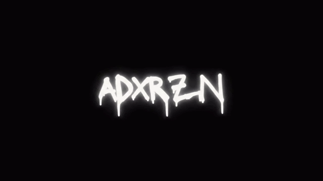

  

<h2 align="center">About Me 👋</h2>

  I am a Junior Web Developer focused on building clean, fully functional applications within the JavaScript and TypeScript ecosystem. I enjoy handling the entire workflow, from optimizing frontend interfaces to setting up robust backend structures and relational databases.
    
  As a junior developer, my goal is to constantly refine how I code by focusing on architecture, improving database performance, and ensuring that everything I build is stable, secure, and easy to maintain.

<h2 align="center">🛠 Toolbox</h2>
<h3 align="center">Frontend</h3>

  
  
  
  
  

<h3 align="center">Backend & Databases</h3>

  
  
  

<h2 align="center">🚀 Project Spotlight</h2>

  <strong>MotoKeeper</strong> | <a href="https://moto-keeper-full.vercel.app">Live Demo</a>

  A full-stack application designed for vehicle maintenance logging, data management, and state tracking. It provides a secure, optimized platform to centralize technical records and monitor logs efficiently.

  <strong>Key Deliverables:</strong> Monolithic architecture built with Next.js App Router, secure user authentication via NextAuth/Bcrypt, and cloud-based PostgreSQL integration.

<h2 align="center">📂 Portfolio</h2>

| Project | Stack | Description | Source |
| :--- | :--- | :--- | :---: |
| **MotoKeeper** | `Next.js` `TypeScript` `PostgreSQL` | Full-stack vehicle maintenance & state logging platform. | [Code](https://github.com/adxrzn/moto-keeper-full) / [Live](https://moto-keeper-full.vercel.app) |
| _Next Project_ | `--` | Upcoming full-stack architecture application. | ⏳ |

<h2 align="center">🎓 Next Milestones</h2>

  <strong>Active Learning:</strong> Enhancing my skills in advanced backend architectures, relational query optimization, and automated testing implementations.
   
  <strong>Technical Goals:</strong> Joining technical projects where I can apply my analytical approach, focus on clean code, and full-stack workflow.

<h2 align="center">Connect with Me 🤝</h2>

  💻 <strong>GitHub:</strong> Check out the MotoKeeper source code and its production branch <a href="https://github.com/adxrzn/MotoKeeper-Full">right here</a>
   
  ✉️ <strong>Email:</strong> <a href="mailto:tu-correo@proton.me">...@...</a>

